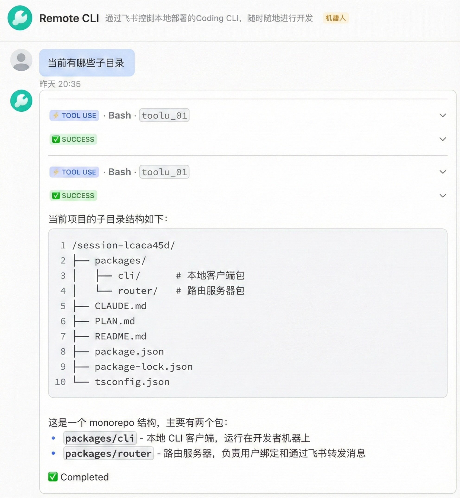
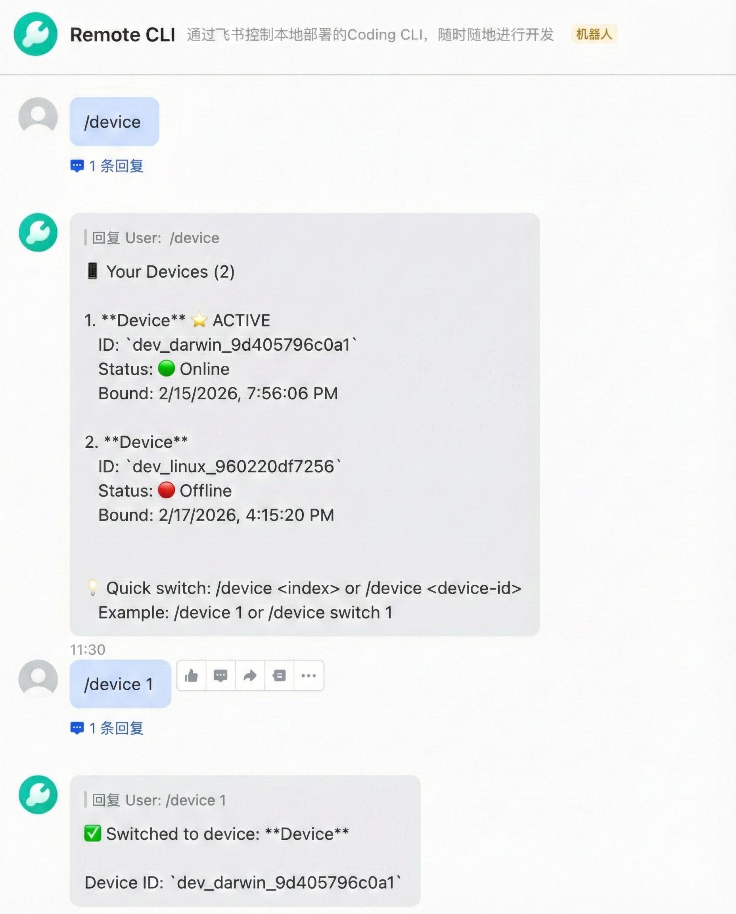

# Remote CLI - Control Claude Code from Mobile via Feishu

[](https://www.npmjs.com/package/@yu_robotics/remote-cli)
[](https://opensource.org/licenses/MIT)
[](https://nodejs.org/)

Remote control your Claude Code CLI from anywhere using your mobile phone through Feishu (Lark) messaging. Continue coding when away from your computer with a mobile-friendly interface.

[中文文档](README.md)

## Features

- 🌍 **Remote Control**: Control your local development environment from anywhere via mobile phone
- 🔒 **Secure**: Directory whitelisting, command filtering, and device authentication
- 📱 **Mobile-Optimized**: Simplified commands and rich text formatting for Feishu
- 🤖 **Claude Code Integration**: Full access to Claude Code's capabilities and context
- ⚡ **Persistent Process**: Long-running Claude process with bidirectional streaming via stdio
- 🚀 **Easy Setup**: One-command installation and initialization

### Usage Examples

<p align="center">
  
  
</p>

## Recommended Use Cases

### Scenario 1: Enterprise Teams (Intranet Deployment)

**Target Users**: Development teams with a unified Feishu organization

**Deployment**:
- Deploy a router server on the company intranet
- Team members install the CLI client on their local machines
- Provide unified service through the Feishu bot

**Advantages**:
- 🔒 **Secure**: Only Feishu external communication is needed; the router server and clients are within the internal network
- 🏢 **Centralized Management**: One Feishu bot serves the entire organization, with administrators managing centrally
- 💰 **Cost-Effective**: A single low-configuration server can support the whole team
- 🔐 **Device Isolation**: Each member can only control their own computer, with no access to others' devices

### Scenario 2: Individual Developers (Home Intranet)

**Target Users**: Independent developers, freelancers

**Deployment**:
- Deploy the router server on your home intranet (e.g., NAS, Raspberry Pi, or spare computer)
- Run the CLI client on your local development machine
- Provide service externally through Feishu

**Advantages**:
- 🏠 **Zero Public Exposure**: The router server doesn't need a public IP; it communicates via Feishu long connection
- 📱 **Access Anywhere**: Control your home computer from your phone via Feishu when you're out
- 💡 **Development Convenience**: Continue programming, check logs, and fix issues when temporarily away from your computer
- 🆓 **Completely Free**: No need to purchase cloud servers; utilize existing equipment

## Architecture

```
┌─────────────────┐         ┌──────────────────────────────┐
│  Feishu Server  │         │  Developer A's Work PC       │
│                 │         │  (Mac/Linux)                 │
│  Developer A's  │◀───────▶│  ┌─────────────────────────┐ │
│  Phone          │         │  │  remote-cli (local)     │ │
│  Private Chat   │         │  │  - WebSocket Client     │ │
│  with Bot       │         │  │  - Claude Code Executor │ │
└─────────────────┘         │  │  - Security Directory   │ │
        │                   │  │    Guard                │ │
        │                   │  └──────────┬──────────────┘ │
        │                   │             ▼                 │
        │                   │  Local Claude Code CLI        │
        ▼                   │  (Using Agent SDK)            │
┌─────────────────┐         └──────────────────────────────┘
│  Router Server  │
│  (Team Deploy)  │         ┌──────────────────────────────┐
│  ┌───────────┐  │         │  Developer B's Work PC       │
│  │ Webhook   │  │         │  ┌─────────────────────────┐ │
│  │ Handler   │  │◀───────▶│  │  remote-cli (local)     │ │
│  └───────────┘  │         │  └─────────────────────────┘ │
│  ┌───────────┐  │         └──────────────────────────────┘
│  │WebSocket  │  │
│  │   Hub     │  │
│  └───────────┘  │
│  ┌───────────┐  │
│  │  Binding  │  │
│  │  Registry │  │
│  └───────────┘  │
└─────────────────┘
```

## Quick Start

```bash
# Install the CLI
npm install -g @yu_robotics/remote-cli

# Initialize and get binding code
remote-cli init --server https://your-router-server.com

# Add allowed directories
remote-cli config add-dir ~/projects

# Start the service
remote-cli start

# Now send the binding code to your Feishu bot
# And start coding from your phone!
```

## Prerequisites

Before you begin, ensure you have:

- **Node.js** >= 18.0.0
- **npm** or **yarn** package manager
- **Claude Code CLI** installed and configured
- Access to a **Feishu (Lark) bot** (your team should deploy a router server)

## Router Server Deployment

> **Note**: Most users don't need to deploy the router server. Your team administrator should deploy one router server for the entire team to share.

The router server forwards messages between Feishu and local CLI clients.

### Prerequisites

- A server with at least **1 CPU core** and **1GB RAM**
- **Node.js** >= 18.0.0
- **Domain name** and SSL certificate (for public deployment with HTTPS)
- A **Feishu bot** created and configured

### Install Router Server

```bash
# Install from npm (recommended)
npm install -g @yu_robotics/remote-cli-router

# Or install from source
git clone <repository-url>
cd remote-cli
npm install
npm run build -w @yu_robotics/remote-cli-router
cd packages/router
npm link
```

### Configure Router Server

```bash
remote-cli-router config
```

You will be prompted for:
- **Feishu App ID** (required)
- **Feishu App Secret** (required)
- Feishu Encrypt Key (optional)
- Feishu Verification Token (optional)
- Server Port (default: 3000)

### Setup Feishu Bot

1. Go to [Feishu Open Platform](https://open.feishu.cn/)
2. Create a new app
3. Enable **Bot** capabilities
4. Configure permissions:
   | Permission | Description | API Scope |
   |------------|-------------|-----------|
   | 获取与发送单聊、群组消息 | Get and send single/group messages | `im:message` |
   | 读取用户发给机器人的单聊消息 | Read user's private messages to bot | `im:message.p2p_msg:readonly` |
   | 以应用的身份发消息 | Send messages as bot | `im:message:send_as_bot` |
5. Enable **Long Connection** in Event & Callback section
6. Subscribe to event: `im.message.receive_v1` ([Receive Message v2.0](https://open.feishu.cn/document/uAjLw4CM/ukTMukTMukTM/reference/im-v1/message/events/receive))
7. Configure webhook URL: `https://your-domain.com/webhook/feishu`
8. Get credentials (App ID, App Secret) and publish the app

### Start Router Server

```bash
# Start the service
remote-cli-router start

# Or use PM2 for production
pm2 start remote-cli-router --name router -- start
```

### Nginx Configuration (Production)

If using a domain with HTTPS, configure Nginx as a reverse proxy:

```nginx
server {
    listen 443 ssl http2;
    server_name your-domain.com;

    ssl_certificate /path/to/ssl/cert.pem;
    ssl_certificate_key /path/to/ssl/key.pem;

    location / {
        proxy_pass http://localhost:3000;
        proxy_http_version 1.1;
        proxy_set_header Upgrade $http_upgrade;
        proxy_set_header Connection 'upgrade';
        proxy_set_header Host $host;
        proxy_cache_bypass $http_upgrade;
    }

    location /ws {
        proxy_pass http://localhost:3000;
        proxy_http_version 1.1;
        proxy_set_header Upgrade $http_upgrade;
        proxy_set_header Connection "Upgrade";
        proxy_set_header Host $host;
        proxy_read_timeout 86400;
    }
}
```

### Client Server Address Guide

When initializing the client, you need to specify the router server address. The address format depends on your deployment method:

| Deployment | Server Address Example | Description |
|-----------|----------------------|-------------|
| **Local/Intranet** | `http://127.0.0.1:3000` | Router and client on same machine |
| **LAN** | `http://192.168.1.100:3000` | Use internal IP + port |
| **Public** | `https://your-domain.com` | Use domain with HTTPS |

**Initialization examples:**

```bash
# Local deployment
remote-cli init --server http://127.0.0.1:3000

# LAN deployment
remote-cli init --server http://192.168.1.100:3000

# Public deployment
remote-cli init --server https://your-domain.com
```

## Installation

### From npm (Recommended)

```bash
npm install -g @yu_robotics/remote-cli
```

Or using yarn:

```bash
yarn global add @yu_robotics/remote-cli
```

### From Source

```bash
# Clone the repository (replace with actual repository URL)
git clone <repository-url>
cd remote-cli

# Install dependencies
npm install

# Build all packages
npm run build

# Link the CLI globally
cd packages/cli
npm link
```

## Usage

### 1. Initialize

Generate a unique device ID and binding code:

```bash
remote-cli init --server https://your-router-server.com
```

Example output:
```
✔ Initializing remote CLI...
✔ Device ID: dev_darwin_a1b2c3d4e5f6
✔ Binding code: ABC-123-XYZ

Please bind your device in Feishu:
1. Open Feishu and find the bot
2. Send: /bind ABC-123-XYZ
3. Wait for confirmation

Binding code expires in 5 minutes.
```

### 2. Bind Device in Feishu

Open your Feishu app and send the binding code to the bot:

```
/bind ABC-123-XYZ
```

### 3. Configure Security

Add allowed directories where Claude Code can operate:

```bash
# Add a single directory
remote-cli config add-dir ~/projects

# Add multiple directories
remote-cli config add-dir ~/work ~/code/company-repos

# View current configuration
remote-cli config show
```

### 4. Start Service

```bash
remote-cli start
```

### 5. Check Status

```bash
remote-cli status
```

### 6. Stop Service

```bash
remote-cli stop
```

## Slash Commands

Once connected, use these commands in Feishu:

### Device Management Commands

| Command | Description |
|---------|-------------|
| `/bind <binding-code>` | Bind a new device |
| `/status` | View status of all devices |
| `/unbind` | Unbind all devices |
| `/device` | List all your bound devices |
| `/device list` | List all your bound devices |
| `/device switch <device-id-or-index>` | Switch to a specific device |
| `/device <device-id-or-index>` | Quick switch to a device |
| `/device unbind <device-id-or-index>` | Unbind a specific device |
| `/help` | Show help information |

### Claude Code Commands Passthrough

All commands/skills supported by local Claude Code are passed through directly, for example:
- `/commit` - Commit code changes
- `/review` - Code review
- `/test` - Run tests
- `/clear` - Clear current session
- And all other built-in Claude Code commands

### Example Workflow

1. **Bind a new device:**
   ```
   /bind ABC-123-XYZ
   ```

2. **Check device status:**
   ```
   /status
   ```

3. **Switch to a specific device:**
   ```
   /device switch dev_darwin_a1b2c3d4
   ```
   Or use index for quick switch:
   ```
   /device 1
   ```

4. **Ask Claude Code to help:**
   ```
   Review the authentication code in src/auth.ts and suggest improvements
   ```

5. **Use Claude Code built-in commands:**
   ```
   /commit
   ```

## Security

### Directory Whitelisting

Only directories explicitly added to the whitelist are accessible:

```bash
remote-cli config add-dir ~/safe/directory
```

### Command Filtering

Dangerous commands are automatically blocked:
- `rm -rf /`
- `sudo` operations on system files
- Direct disk writes (`dd`, `mkfs`)
- Fork bombs and other malicious patterns

### Device Authentication

- Each device generates a **unique ID** based on machine hardware
- Binding codes **expire after 5 minutes**
- Each user can only control **their bound devices**
- Unbind at any time: `/unbind` in Feishu

## Troubleshooting

### Service won't start

```bash
# Check if already running
remote-cli status

# View logs
remote-cli logs

# Restart
remote-cli stop
remote-cli start
```

### Connection issues

```bash
# Check network
ping your-router-server.com

# Verify configuration
remote-cli config show

# Re-initialize
remote-cli init --server https://your-router-server.com --force
```

### Binding code expired

```bash
# Generate new binding code
remote-cli init --force
```

## Contributing

We welcome contributions! Please see [CONTRIBUTING.md](CONTRIBUTING.md) for guidelines.

## License

MIT License - see [LICENSE](LICENSE) file for details.

---

## Appendix

### Configuration Reference

#### Local Client Config (`~/.remote-cli/config.json`)

```json
{
  "deviceId": "dev_darwin_xxx",
  "serverUrl": "https://your-router-server.com",
  "openId": "ou_xxx",
  "security": {
    "allowedDirectories": [
      "/Users/yourname/projects",
      "/Users/yourname/work"
    ]
  },
  "service": {
    "running": true,
    "startedAt": 1234567890,
    "pid": 12345
  }
}
```

### Development

```bash
# Clone repository (replace with actual repository URL)
git clone <repository-url>
cd remote-cli

# Install dependencies
npm install

# Build all packages
npm run build

# Run tests
npm test

# Run CLI in development mode
npm run cli:dev

# Run router in development mode
npm run router:dev
```

### Support

- Issues: Please submit via the project's Issue page
- Discussions: Please participate via the project's Discussion page
